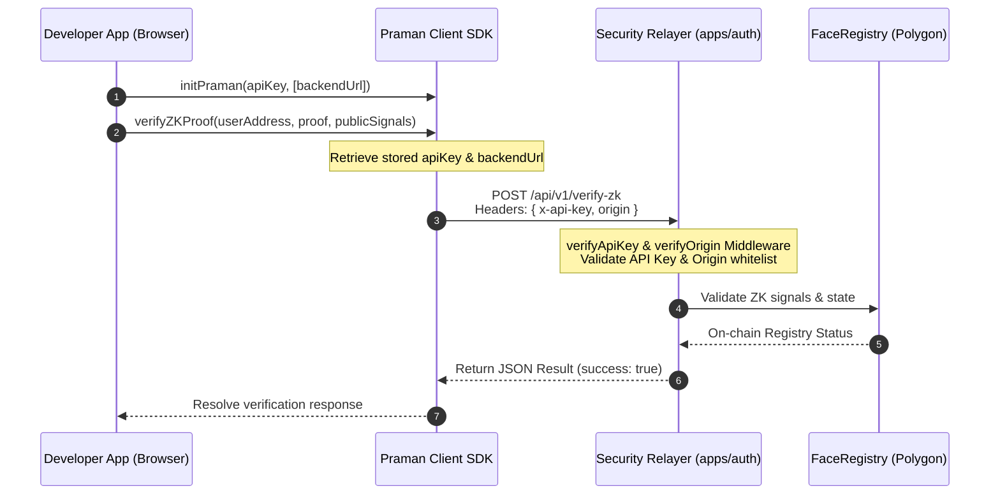

# @praman-network/sdk

[](https://www.npmjs.com/package/@praman-network/sdk)
[](#)
[](#)
[](#)

PramanAuth is a decentralized Identity-as-a-Service (IaaS) SDK providing privacy-preserving, Zero-Knowledge (ZK) biometric authentication for Web3 applications. Powered by a hybrid Web2.5 architecture, PramanAuth secures client-to-backend communication via **API Key authentication** and **Origin Whitelisting**, enabling gasless biometric verification for end-users.

---

## Why PramanAuth?

Modern authentication solutions force a trade-off between user convenience and security. PramanAuth bridges this gap by combining decentralized biometrics with zero-knowledge proofs:

*   **Zero Biometric Leakage:** No raw biometric data (images, videos, or raw face descriptors) is ever sent to or stored on any centralized server. Biometric templates are quantized, hashed, and encrypted client-side using wallet signatures before being archived on IPFS.
*   **Browser-Side ZK Verification:** Biometric comparisons are computed locally in the user's browser using client-side **Groth16 ZK-SNARK Proving (via SnarkJS)**. Raw biometrics remain completely private, and only the ZK proof is dispatched for verification.
*   **Gasless User Experience:** All blockchain writes, gas sponsorship, and IPFS pinning are managed securely by the Backend Relayer. Users get a fast, signature-based sign-in experience with zero transaction costs.

---

## Installation & Prerequisites

To prevent compilation and runtime helpers resolution issues in bundlers, **`tslib` is required as a peer dependency** of `@praman-network/sdk`. Install both packages using npm:

```bash
npm install @praman-network/sdk tslib
```

### Polyfill Setup for Bundlers (Vite)
Web3 libraries depend on Node.js built-ins. If you are using Vite, install Node polyfills to avoid `Buffer is not defined` or `global is not defined` runtime errors:

**1. Install the polyfill plugin:**
```bash
npm install vite-plugin-node-polyfills --save-dev
```

**2. Update `vite.config.ts` or `vite.config.js`:**
```javascript
import { defineConfig } from 'vite';
import react from '@vitejs/plugin-react';
import { nodePolyfills } from 'vite-plugin-node-polyfills';

export default defineConfig({
  plugins: [
    react(),
    nodePolyfills({
      globals: {
        Buffer: true,
        global: true,
        process: true,
      },
    }),
  ],
});
```

---

## SDK Initialization

The SDK client must be initialized once at the entry point of your frontend application. The client stores the configured API key and backend service endpoint securely within the SDK instance state for subsequent API calls.

Initialize using one of the following methods:

### Method 1: Simple Initialization (Default Production)
Suitable for standard production applications. Initializes the client pointing to the global Praman production relayer gateway (`https://api.praman.network`):

```typescript
import { initPraman } from '@praman-network/sdk';

// Initializes with production relayer defaults
const praman = initPraman("pm_live_your_api_key");
```

### Method 2: Custom Configuration (Local/Custom Backend)
Required when testing integrations locally against an Express microservice backend (e.g., `http://localhost:5050`) or using a customized deployment configuration:

```typescript
import { initPraman } from '@praman-network/sdk';

const praman = initPraman({
  apiKey: "pm_dev_your_api_key",
  network: "polygon-amoy",
  backendUrl: "http://localhost:5050", // Custom/Local relayer endpoint
  livenessLevel: "standard"            // 'strict' | 'standard' | 'off'
});
```

---

## Framework Support

The `@praman-network/sdk` is designed to be framework-agnostic. 

### 1. Next.js (App Router)
Since Next.js App Router renders pages server-side by default, SDK components and hooks must be constrained to the client boundary using the `'use client'` directive.

Create a wrapper client component or add the directive to the top of your layout/page:

```typescript
'use client';

import React, { useEffect } from 'react';
import { initPraman } from '@praman-network/sdk';

// Initialize the SDK inside client components
const praman = initPraman(
  process.env.NEXT_PUBLIC_PRAMAN_API_KEY || '',
  process.env.NEXT_PUBLIC_PRAMAN_BACKEND_URL // Will fall back to production if undefined
);

export default function AuthPage() {
  // Client-side authentication logic
  return (
    <div>
      <button onClick={() => praman.loginWithPopup()}>Sign In</button>
    </div>
  );
}
```

### 2. Vanilla JS / Single Page Applications (SPAs)
For custom scripts or simple frontend integrations, import from the compiled CommonJS or ES build module:

```javascript
import { initPraman, verifyZKProof } from '@praman-network/sdk';

// Initialize client
initPraman("pm_dev_key", "http://localhost:5050");

// Dispatch proof verification
async function authenticateUser(address, proof, signals) {
  try {
    const result = await verifyZKProof(address, proof, signals);
    if (result.success) {
      console.log("Authenticated successfully!");
    }
  } catch (error) {
    console.error("Verification failed:", error.message);
  }
}
```

---

## Security Architecture

To protect the verification relay against Sybil attacks and credential leaks, communication is locked down via two mechanisms configured in your **Developer Dashboard**:

1.  **API Key Validation (`x-api-key`):** The SDK automatically transmits your configured API key in the request headers on all verification API calls.
2.  **Origin Whitelisting:** The security relayer checks incoming request headers (`origin` and `referer`). Requests from non-whitelisted domains are strictly rejected by the backend to prevent API key usage outside authorized apps.



---

## Verification & Production Hardening

### Environment Guard
The SDK contains an automated **Environment Guard** that monitors execution modes.

> [!WARNING]
> **Environment Strict Mode:** In production builds (`process.env.NODE_ENV === 'production'` or `import.meta.env.MODE === 'production'`), the SDK enforces a strict, hard-fail security policy. If ZK proof generation fails due to browser memory limits, asset delivery problems, or system timeouts, authentication fails immediately. Mock proofs are strictly rejected in production.

### Backend Token Filtering
When integrating PramanAuth within your own server backend, always inspect and filter claims:

> [!IMPORTANT]
> **Mock Token Filter:** Always check the `is_mock` flag in the decoded JWT payload on your backend. If `is_mock: true` is detected in a production build, your backend **must** reject the authentication session immediately to prevent mock-bypass exploits.

```typescript
import { getPramanClient } from '@praman-network/sdk';

const praman = getPramanClient();
const result = praman.verifyToken(receivedToken);

if (!result.valid) {
  throw new Error("Invalid cryptographic session token");
}

if (result.payload.is_mock && process.env.NODE_ENV === 'production') {
  throw new Error("Unauthorized: Mock tokens are restricted in production environments");
}
```

---

## Troubleshooting

#### 1. Why does my registration fail with "Biometric face identity already registered"?
The Polygon Amoy smart contract registry enforces Sybil resistance by hashing face descriptors. If a user's biometric baseline matches an already registered identity, the contract rejects the transaction. For development, use mock flags or register with a unique face baseline.

#### 2. CORS Errors connecting to Backend Relayer
Verify that your origin domain (e.g. `http://localhost:5173`) is listed in the allowed origins configuration of your Express backend relayer or your Developer Dashboard settings.

#### 3. ZK Proof Generation crashes or times out
Ensure that WebAssembly support is enabled in the target browser environment. WebAssembly is required to execute the client-side snarkjs prover efficiently.

---

## Changelog

*   **`v0.1.10` (Current)**
    *   Added support for direct API key verification headers and custom backend relay routing.
    *   Implemented standalone `verifyZKProof` and `loginWithPraman` exports.
    *   Moved `tslib` to peerDependencies.
*   **`v0.1.2`**
    *   Implemented `getStableVector` biometric stabilization layer.
*   **`v0.1.0`**
    *   Initial release with Lit Protocol encryption, IPFS enclaves, and basic face scanning.
