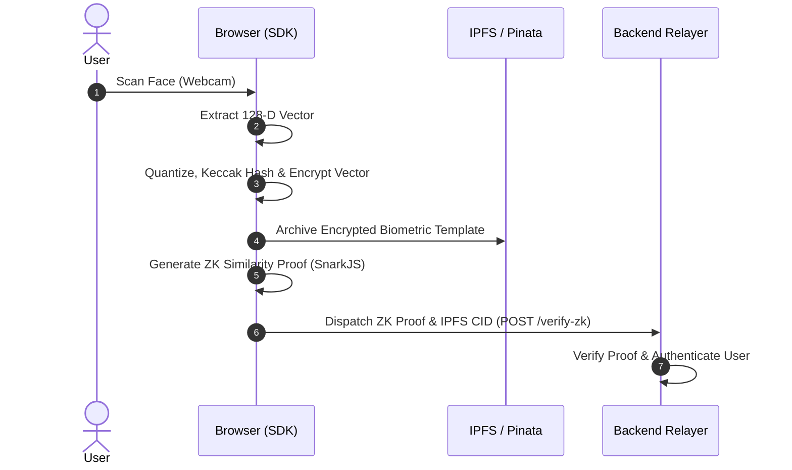

# Security Architecture & Best Practices

PramanAuth is designed with a defense-in-depth approach, protecting both user biometric privacy and developer platform resource access. This document outlines the security architecture of the system and best practices for production deployment.

---

## The Zero-Leakage Biometric Model

PramanAuth operates on the strict principle that **no raw biometric data is ever sent to or stored on a server**.

1. **Local Feature Extraction**: Biometric face descriptors are extracted locally in the browser using browser-optimized neural networks.
2. **Keccak Hashing & Quantization**: The 128-dimensional floating point descriptors are quantized into integers and Keccak-hashed.
3. **Local Encryption & Signature**: Biometric templates are encrypted client-side using a signature generated from the user's connected Ethereum wallet. The raw template is never exposed.
4. **Local Proving (ZK-SNARKs)**: Biometric comparison (calculating Euclidean distance between the current scan and the registered signature) is computed locally using client-side **Groth16 ZK-SNARK Proving**. Only the resulting proof is dispatched to the backend.

---

## Developer Security Safeguards

To prevent abuse of verification resources and ensure that third-party integrations are authentic, the Backend Relayer implements a dual-safeguard verification model.

### 1. Origin Whitelisting

The backend validates the `Origin` header of incoming HTTP requests against a list of approved domain origins registered for the given API key.

- **Development**: During sandbox testing, origins like `http://localhost:3000` or `http://localhost:5173` are typically permitted.
- **Production**: When moving to production, you must restrict the whitelisted origins to your exact production subdomains (e.g. `https://app.yourproject.com`). Any request presenting your API key from an unauthorized domain will be rejected with a `403 Forbidden` error.

> [!WARNING]
> While origin headers can be spoofed in non-browser environments (such as curl or backend scripts), they are strictly enforced by user browsers under standard CORS policies. This ensures that unauthorized sites cannot load the SDK and charge verification fees to your account.

---

### 2. API Key Rotation

Your API keys grant access to the Praman Auth Relayer. If a key is compromised, unauthorized actors could use it to submit verifications or drain sponsored transaction limits.

#### Keys Rotation Best Practices
- **Never Commit Keys**: Do not commit API keys to public repositories. Use environment variables (`.env`) to configure your applications.
- **Scope Keys Appropriately**: Use development keys (`pm_dev_...`) for integration testing and staging. Use production keys (`pm_prod_...`) only in your production builds.
- **Rotate Key Periodically**: In the event of a developer staff departure or potential leak, rotate your keys immediately in the Praman Console.

---

### 3. Rate Limiting Protection

All verification routes are protected by IP-based rate limiting to prevent denial-of-service (DoS) and brute-force trial attacks on biometric proofs. If your app exceeds rate limits, the gateway will return `429 Too Many Requests`. Ensure your client-side implementation handles rate-limiting backoffs gracefully.
